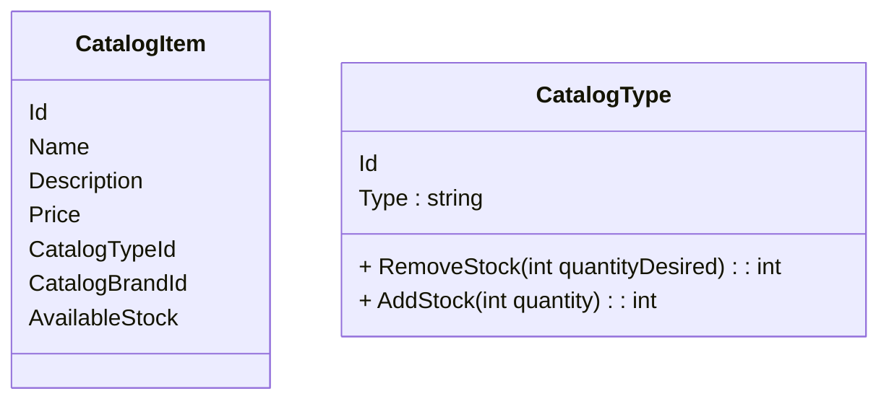

# Class Diagram for Microsoft eShop

Simplified UML Class diagram for Microsoft eShop Reference Application - "Northern Mountains":
https://github.com/dotnet/eShop

```mermaid
classDiagram

   class CatalogItem{
      Id
      Name
      Description
      Price
      CatalogTypeId
      CatalogBrandId
      AvailableStock

   }

   class CatalogType{
      Id
      Type : string
      + RemoveStock(int quantityDesired) : int
      + AddStock(int quantity) : int 
   }
```

