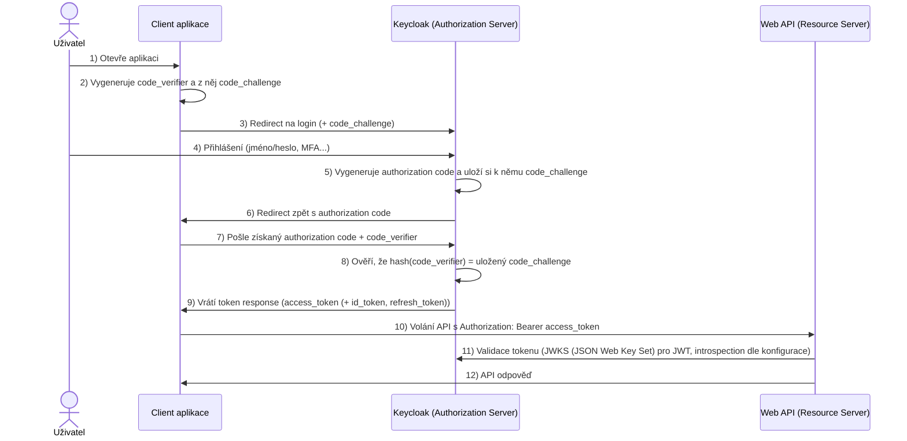

# 06 Authentication and Authorization

**autor: Erik Král ekral@utb.cz**

S asistencí: GitHub Copilot

## 🎯 Definice

U zabezpečení webových aplikací v .NET máme dvě běžné možnosti.

První možnost jsou **individual accounts** - uživatelské účty jsou uložené v databázi (typicky přes Entity Framework a ASP.NET Core Identity) a aplikace poskytuje vlastní přihlášení.

Druhá možnost je použití externího poskytovatele identity přes **OpenID Connect/OAuth2**. To je vhodné ve chvíli, kdy chceme zabezpečit webového i mobilního klienta a předávat access token do API. Typickými providery jsou Auth0, Microsoft Entra, Duende IdentityServer nebo Keycloak.

## Co je to OpenID Connect

**OpenID Connect (OIDC)** je vrstva nad OAuth 2.0, která přidává **autentizaci uživatele**.

- OAuth 2.0 řeší hlavně **autorizaci** (kdo smí přistupovat k jakému API).
- OpenID Connect řeší **identitu uživatele** (kdo je přihlášený uživatel).

Proto v praxi často říkáme:
- OAuth2 = přístup k API
- OIDC = přihlášení uživatele

OpenID Connect navíc definuje například:
- `id_token` (token s identitou uživatele),
- endpoint `userinfo`,
- standardní claimy (`sub`, `email`, `preferred_username`, ...).

## Jak funguje Authorization Code Flow

Nejčastější scénář pro webovou aplikaci + API je **Authorization Code flow**.

### Role

- **Uživatel**: člověk v prohlížeči
- **Client**: aplikace (např. Blazor Web)
- **Authorization Server**: Keycloak
- **Resource Server**: Web API

### Tok požadavků



Poznámka:
- Ve SPA se dnes doporučuje Authorization Code flow s PKCE.
- `access_token` je pro API, `id_token` je pro klienta (identita), `refresh_token` slouží k obnovení session bez nového loginu.

### Co znamená Authorization Code flow

Nastavení `ResponseType = Code` znamená, že klient používá **Authorization Code flow**.

Keycloak v prvním kroku nevrací tokeny přímo do prohlížeče, ale vrátí jen krátkodobý **autorizační kód** (`code`).
Teprve backend aplikace tento kód vymění na token endpointu za tokeny.

Průběh krok za krokem:
- 1) Klient pošle uživatele na authorization endpoint s `response_type=code` + PKCE (`code_challenge`, `code_challenge_method=S256`).
- 2) Uživatel se přihlásí v Keycloaku.
- 3) Keycloak vydá `authorization code` a sváže ho s přijatým `code_challenge`.
- 4) Keycloak přesměruje prohlížeč zpět na `redirect_uri` s parametrem `code`.
- 5) Aplikace na serveru pošle `POST` na token endpoint (`grant_type=authorization_code`, `code`, `redirect_uri`, `client_id`, `code_verifier`, případně i `client_secret`).
- 6) Keycloak znovu spočítá challenge z `code_verifier` a porovná ji s challenge uloženou u daného `code`.
- 7) Pokud porovnání sedí, vrátí `access_token`, případně `id_token` a `refresh_token`.

Vztah mezi hodnotami v PKCE:
- `code_verifier` je tajná náhodná hodnota, kterou zná jen klient.
- `code_challenge` je odvozená hodnota z `code_verifier` (typicky S256 hash), která se posílá v prvním requestu.
- `authorization code` je dočasný kód vydaný po loginu a je v Keycloaku navázán na konkrétní `code_challenge`.
- token endpoint vydá tokeny jen tehdy, když `code_verifier` odpovídá `code_challenge` svázanému s vráceným `code`.

Co je důležité:
- přes browser (query string) jde jen autorizační požadavek a návrat s kódem,
- výměna kódu za tokeny je backchannel komunikace server <-> Keycloak,
- to je bezpečnější než implicit flow, kde se tokeny vracely přímo do frontendu.

### Tokeny v OIDC/OAuth2


| Token | Formát | Pro koho | Účel |
|---|---|---|---|
| `access_token` | JWT nebo nečitelný řetězec | Resource Server (API) | Autorizace přístupu k API |
| `id_token` | JWT | Client (aplikace) | Identita přihlášeného uživatele |
| `refresh_token` | nečitelný řetězec | Authorization Server | Obnovení access tokenu bez nového loginu |

- `id_token`: token identity uživatele pro klientskou aplikaci (kdo je přihlášený). Používá se pro přihlášení a práci s identitou v klientovi, běžně se neposílá do Web API. Je vždy ve formátu **JSON Web Token (JWT)**. Keycloak vrací `id_token` jen pokud scope obsahuje `openid`.
- `access_token`: token pro API, nese oprávnění (scope/role/audience) pro autorizaci požadavků.
	- `access_token` může být **JWT** (ověřuje se přes JWKS - JSON Web Key Set, tedy sadu veřejných klíčů od autorizačního serveru).
	- Nebo může být **opaque/reference token** (nečitelný řetězec), který API ověřuje přes introspection endpoint autorizačního serveru.

`Bearer` znamená „držitel“. V praxi to znamená, že kdo token drží, ten ho může použít pro přístup k API.
Proto se token posílá v hlavičce `Authorization: Bearer <token>` a je nutné ho chránit před únikem (HTTPS, krátká expirace, bezpečné uložení).

#### Jak vypadá požadavek na Keycloak

Klient při přesměrování uživatele na login posílá authorization request, například:

```http
GET /realms/utb-school/protocol/openid-connect/auth?
	client_id=utb-school-web&
	response_type=code&
	redirect_uri=https%3A%2F%2Flocalhost%3A5001%2Fsignin-oidc&
	scope=openid%20profile%20email&
	code_challenge=Rk9vQmFyQmF6MTIzNDU2Nzg5X1NIRTI1Ng&
	code_challenge_method=S256&
	state=xyz123&
	nonce=abc123 HTTP/1.1
Host: auth.example.cz
```

Význam `scope=openid profile email`:
- `openid`: aktivuje OpenID Connect a umožní vrátit `id_token`. Bez `openid` -> běží jen OAuth2 autorizace a `id_token` se obvykle nevrací.
- `profile`: klient žádá základní profilové údaje uživatele (`name`, `preferred_username`, `given_name`, `family_name`).
- `email`: klient žádá emailové claimy (`email`, případně `email_verified`).

Následně proběhne výměna `code` za tokeny přes backchannel `POST` na token endpoint:

```http
POST /realms/utb-school/protocol/openid-connect/token HTTP/1.1
Host: auth.example.cz
Content-Type: application/x-www-form-urlencoded

grant_type=authorization_code&
code=SplxlOBeZQQYbYS6WxSbIA&
redirect_uri=https%3A%2F%2Flocalhost%3A5001%2Fsignin-oidc&
client_id=utb-school-web&
code_verifier=QWxhZGRpbjpvcGVuIHNlc2FtZQ
```

Poznámka: u confidential klienta může být navíc poslán i `client_secret`.

Po výměně autorizačního kódu na token endpointu vrací Keycloak například:

```json
{
	"access_token": "eyJ...",
	"expires_in": 300,	"refresh_expires_in": 1800,
	"refresh_token": "eyJ...",
	"token_type": "Bearer",
	"id_token": "eyJ...",
	"scope": "openid profile email"
}
```

Pole `id_token` je v odpovědi právě proto, že v požadavku byl scope `openid`.

Stručně:
- `access_token` je pro API a nese autorizační data (`aud`, `scope`, role, ...).
- `id_token` je pro klienta a nese identitu uživatele (`sub`, `email`, `name`, ...).

## Ukázka JWT tokenu a mapování

JWT má tvar:

`header.payload.signature`

- `header`: metadata (algoritmus, typ tokenu),
- `payload`: claimy (data o uživateli a oprávněních),
- `signature`: kryptografický podpis.

### Příklad access tokenu (zakódovaný JWT)

Takto vypadá skutečný `access_token` — tři Base64URL části oddělené tečkou:

```
eyJhbGciOiJSUzI1NiIsInR5cCIgOiAiSldUIiwia2lkIiA6ICJhYjEyY2Q
zNCJ9.eyJleHAiOjE3NzY3NTEyMDAsImlhdCI6MTc3Njc0NzYwMCwiaXNzIj
oiaHR0cHM6Ly9hdXRoLmV4YW1wbGUuY3ovcmVhbG1zL3V0Yi1zY2hvb2wiLC
JhdWQiOlsiYWNjb3VudCIsInV0Yi1zY2hvb2wtYXBpIl0sInN1YiI6IjhmMm
Q5YTMwLTJlMjQtNGY4Yi05ZDI3LTY3ZDNmZjE5ZjE0NSIsInR5cCI6IkJlYX
JlciIsImF6cCI6InV0Yi1zY2hvb2wtd2ViIiwic2NvcGUiOiJvcGVuaWQgcH
JvZmlsZSBlbWFpbCByb2xlcyIsInByZWZlcnJlZF91c2VybmFtZSI6Im5vdm
FraiIsImVtYWlsIjoiamFuLm5vdmFrQHV0Yi5jeiIsInJlYWxtX2FjY2Vzcy
I6eyJyb2xlcyI6WyJzdHVkZW50Il19fQ.podpis_RS256
```

Každou část lze dekódovat (např. na [jwt.io](https://jwt.io)):

- část 1 (header): `{"alg":"RS256","typ":"JWT","kid":"ab12cd34"}`
- část 2 (payload): viz JSON níže
- část 3 (signature): kryptografický podpis pomocí privátního klíče Keycloaku — nelze dekódovat, pouze ověřit

### Příklad dekódovaného payloadu access_token

```json
{
	"exp": 1776751200,
	"iat": 1776747600,
	"iss": "https://auth.example.cz/realms/utb-school",
	"aud": ["account", "utb-school-api"],
	"sub": "8f2d9a30-2e24-4f8b-9d27-67d3ff19f145",
	"typ": "Bearer",
	"azp": "utb-school-web",
	"scope": "openid profile email roles",
	"preferred_username": "novakj",
	"email": "jan.novak@utb.cz",
	"realm_access": {
		"roles": ["student", "offline_access"]
	},
	"resource_access": {
		"utb-school-api": {
			"roles": ["read:marks", "write:homework"]
		}
	}
}
```

V tomto tokenu platí:
- `realm_access` = **realm roles** v Keycloaku.
- `resource_access` = **client roles** v Keycloaku (specifické role pro konkrétního klienta/API).


### Příklad dekódovaného payloadu id_token

```json
{
    "exp": 1776751200,
    "iat": 1776747600,
    "iss": "https://auth.example.cz/realms/utb-school",
    "aud": "utb-school-web",
    "sub": "8f2d9a30-2e24-4f8b-9d27-67d3ff19f145",
    "azp": "utb-school-web",
    "name": "Jan Novák",
    "preferred_username": "novakj",
    "given_name": "Jan",
    "family_name": "Novák",
    "email": "jan.novak@utb.cz"
}
```

## Co je Keycloak

**Keycloak** je open-source Identity and Access Management (IAM) server.

Poskytuje:
- přihlášení uživatelů (login),
- správu uživatelů, rolí a skupin,
- vystavování tokenů (JWT),
- podporu standardů OAuth2 a OpenID Connect.

## Pojmy v Keycloaku

### Claim

**Claim** je pojmenovaná informace (klíč–hodnota) uložená v tokenu.

Například:
- `"email": "jan.novak@utb.cz"` — emailová adresa uživatele,
- `"sub": "8f2d9a30-..."` — jedinečný identifikátor uživatele,
- `"realm_access": { "roles": ["student"] }` — role uživatele.

Claims jsou serializovány jako JSON objekt v payloadu JWT. Jejich obsah a názvy jsou dány:
1. standardy (OIDC, OAuth2) — např. `sub`, `iss`, `exp`, `email`,
2. mapováním nastaveným v Keycloaku (client scopes, mappers).

> **Claim** = konkrétní datová položka v tokenu. **Scope** = pojmenovaná skupina claimů, která se přidá do tokenu.

### Realm

**Realm** je izolovaný prostor (tenant), ve kterém existují:
- uživatelé,
- role,
- klienti,
- konfigurace autentizace.

Co je v jednom realm, není automaticky dostupné v jiném realm.

### Client

**Client** reprezentuje aplikaci, která komunikuje s Keycloakem.

Příklady:
- frontend aplikace (Blazor/Web SPA),
- backend API,
- mobilní aplikace.

U clienta nastavujeme například:
- typ přístupu (public/confidential),
- redirect URI,
- povolené flow,
- client scopes.

### Client Scope

**Client scope** je balíček claimů a pravidel, který říká, jaké informace se mají dostat do tokenu.

Může být:
- **default** (přidá se automaticky),
- **optional** (přidá se jen když si ho client explicitně vyžádá).

#### Mapping v client scope

V Keycloaku znamená **mapping** to, **jaké údaje (claimy) se vloží do tokenu** a jak se budou jmenovat.

Příklady mappingu:
- uživatelské jméno -> `preferred_username`,
- email -> `email`,
- role -> `realm_access.roles` nebo `resource_access.<client>.roles`.

### Audience Mapper

**Audience mapper** doplňuje claim `aud` (audience), tedy pro koho je token určen.

To je důležité pro API validaci:
- API může odmítnout token, který není určený právě pro něj,
- pomáhá oddělit tokeny mezi různými službami.

### Users client scope

`users` (nebo obdobně pojmenovaný scope v dané instalaci) bývá používán pro claimy vztahující se k uživateli.

Typicky obsahuje mappingy jako:
- `name`,
- `preferred_username`,
- `given_name`,
- `family_name`,
- `email`.

Konkrétní obsah je vždy dán konfigurací v daném realm.

### Realm users

**Realm users** jsou uživatelské účty uložené přímo v daném realm.

Jejich data (username, email, role, skupiny, atributy) se mohou přes mapping propsat do tokenů.

### Jak se claimy mapují z Keycloaku

- `iss`: generuje Keycloak podle URL a názvu realm.
- `sub`: interní ID uživatele v realm.
- `aud`: doplní například Audience mapper.
- `preferred_username`, `email`: mapování z profilu uživatele (často přes scope jako profile/email/users).
- `realm_access.roles`: role přiřazené uživateli na úrovni realm.
- `resource_access.<client>.roles`: role přiřazené uživateli pro konkrétní client.

Praktický důsledek:
- Když v Keycloaku změníme mapping v client scope, změní se obsah claimů v nově vydaných tokenech.
- API autorizace pak musí očekávat stejné názvy claimů, jaké mapujeme.

## Shrnutí pro praxi v .NET

- V klientu řešíme login přes OpenID Connect.
- V API ověřujeme JWT `access_token`.
- V Keycloaku pečlivě nastavíme realm, client, scopes a mappingy claimů.
- V autorizaci v API kontrolujeme role/scope/audience podle obsahu tokenu.

## Struktura projektu

Náš projekt bude mít následující strukturu:
- **UTB.School.Web** - Blazor klient
- **UTB.School.WebApi** - Web API
- **UTB.School.WebSse** - Klient zobrazující SSE zprávy.

---

## Implementace v Aspire

### AppHost

V projektu `UTB.School.AppHost` použijeme integrační balíček pro Keycloak (jde o preview verzi) `Aspire.Hosting.Keycloak`:

Pak v `AppHost.cs` přidáme Keycloak jako resource v Aspire orchestraci:

```csharp
    var keycloak = builder.AddKeycloak("keycloak", 8080)
               			  .WithContainerName("utb-school-keycloak")
               		      .WithDataVolume("utb-school-keycloak-data")
               			  .WithLifetime(ContainerLifetime.Persistent);
```

Poznámka:
- Název resource (`"keycloak"`) musí odpovídat názvu, který později použijeme v `AddKeycloakJwtBearer(serviceName: ...)` ve WebApi.

### WebApi

V projektu `UTB.School.WebApi` použijeme balíček `Aspire.Keycloak.Authentication`, opět jde o preview verzi:

Do `Program.cs` přidáme autentizaci JWT přes Keycloak, autorizaci a ochranu endpointu rolí:

```csharp
builder.Services.AddAuthentication()
	.AddKeycloakJwtBearer(
		serviceName: "keycloak",
		realm: "utb-school",
		options =>
		{
			options.Audience = "utb-school-webapi";
			options.RequireHttpsMetadata = false; // jen pro dev
		}
	);

builder.Services.AddAuthorization();

app.UseAuthentication();
app.UseAuthorization();

app.MapGet("/students", GetStudents)
   .RequireAuthorization(pb => pb.RequireRole("student-admin"));
```

Poznámka: Vždy platí pořadí middleware `UseAuthentication()` a pak `UseAuthorization()`.

### Blazor Web (UTB.School + Duende.AccessTokenManagement.OpenIdConnect)

Poznámka: Tato implementace je pro **Blazor Server Interactivity**
(`AddInteractiveServerComponents`). V **Blazor WebAssembly** je autentizace
řešena jinak (běží v prohlížeči, token handling je client-side a konfigurace
se dělá jinými extension metodami pro WASM hosta).

V projektu `UTB.School.Web` je provider identity **Keycloak** a balíček
`Duende.AccessTokenManagement.OpenIdConnect` slouží pro **správu user access tokenu**
při volání Web API.

Co se děje v `Program.cs`:

- Nastaví se autentizace přes cookie + OIDC challenge.
- OIDC je napojené na Keycloak (`AddKeycloakOpenIdConnect`).
- Uloží se tokeny (`SaveTokens = true`) a zapne se podpora refresh tokenu (`offline_access`).
- Zapne se Duende token management (`AddOpenIdConnectAccessTokenManagement`).
- `SchoolService` je registrovaná jako `AddUserAccessTokenHttpClient`, takže
	Authorization header s bearer tokenem přidává Duende automaticky.

```csharp
builder.Services.AddAuthentication(options =>
{
  options.DefaultScheme = CookieAuthenticationDefaults.AuthenticationScheme;
  options.DefaultChallengeScheme = OpenIdConnectDefaults.AuthenticationScheme;
})
.AddCookie()
.AddKeycloakOpenIdConnect(
  serviceName: "keycloak",
  realm: "utb-school",
  options =>
  {
    options.ClientId = "utb-school-web";
    options.ClientSecret = "..."; // jen dev
    options.ResponseType = OpenIdConnectResponseType.Code;
    options.Scope.Add("openid");
    options.Scope.Add("offline_access");
    options.SaveTokens = true;
    options.RequireHttpsMetadata = false; // jen dev
    options.TokenValidationParameters.NameClaimType = "preferred_username";
  });

builder.Services.AddOpenIdConnectAccessTokenManagement(options =>
{
  options.RefreshBeforeExpiration = TimeSpan.FromSeconds(30);
});

builder.Services.AddUserAccessTokenHttpClient<SchoolService>(
  configureClient: (_, c) => c.BaseAddress = new Uri("https://webapi"));
```

Kromě toho jsou v aplikaci pomocné endpointy:

- `GET /login` zavolá `ChallengeAsync(...)` a přesměruje uživatele na login do Keycloaku.
- `POST /logout` odhlásí lokální cookie session, provede revoke refresh tokenu
	(`RevokeRefreshTokenAsync`) a odhlásí OIDC session.

Ukázka endpointů z `Program.cs`:

```csharp
app.MapGet("/login", async (HttpContext ctx, string? returnUrl) =>
{
	string redirectUri = "/";

	if (!string.IsNullOrWhiteSpace(returnUrl) && Uri.IsWellFormedUriString(returnUrl, UriKind.Relative))
	{
		redirectUri = returnUrl;
	}

	await ctx.ChallengeAsync(OpenIdConnectDefaults.AuthenticationScheme, new AuthenticationProperties
	{
		RedirectUri = redirectUri
	});
});

// Logout dělám přes form a POST kvůli dvojitému načtení stránky
app.MapPost("/logout", async (HttpContext ctx) =>
{
	string? idToken = await ctx.GetTokenAsync("id_token");

	await ctx.RevokeRefreshTokenAsync();

	await ctx.SignOutAsync(CookieAuthenticationDefaults.AuthenticationScheme);
	await ctx.SignOutAsync(OpenIdConnectDefaults.AuthenticationScheme, new AuthenticationProperties
	{
		RedirectUri = "/students",
		Parameters = { { "id_token_hint", idToken ?? string.Empty } }
	});
});
```

Ukázka zabezpečené stránky `Students.razor`:

```razor
@page "/students"
@using Microsoft.AspNetCore.Components.Authorization
@using UTB.School.Contracts
@rendermode @(new InteractiveServerRenderMode(prerender: false))
@inject SchoolService SchoolService

<AuthorizeView Roles="student-admin">
	<Authorized>
		<p>Welcome back @context.User.Identity?.Name !</p>

		<form action="logout" method="post">
			<AntiforgeryToken />
			<button type="submit" class="nav-link btn btn-link">Logout</button>
		</form>
		
	</Authorized>
	<NotAuthorized>
		<p><a href="/login?returnUrl=students">Log in</a> please.</p>
	</NotAuthorized>
</AuthorizeView>

@code {
	private StudentDto[]? students;

	protected override async Task OnInitializedAsync()
	{
		students = await SchoolService.GetStudentsAsync();
	}
}
```

Co je důležité:

- `AuthorizeView Roles="student-admin"` omezí viditelnou část UI podle role.
- Nepřihlášený uživatel vidí odkaz na `GET /login`.
- Logout jde přes `POST /logout` a obsahuje `<AntiforgeryToken />`.
- API endpoint `/students` je navíc chráněn na serveru přes `.RequireAuthorization(pb => pb.RequireRole("student-admin"))`, takže je chráněné UI i API.


---

### Troubleshooting (reálná verze v UTB.School)

1. Ve `UTB.School.Web` je nainstalovaný balíček
	`Duende.AccessTokenManagement.OpenIdConnect` a token management je aktivní
	přes `AddOpenIdConnectAccessTokenManagement(...)`.
2. API klient je registrován přes `AddUserAccessTokenHttpClient<SchoolService>(...)`,
	ne přes vlastní `DelegatingHandler`.
3. V `UTB.School.WebApi` je audience nastavena na `utb-school-webapi`.
4. Ve WebApi běží middleware v pořadí `UseAuthentication()` -> `UseAuthorization()`.
5. V AppHost existuje resource `keycloak` a oba projekty (`web`, `webapi`) na ni
   maji `.WithReference(keycloak)`.
6. V Keycloak klientovi `utb-school-web` je povolený Authorization Code flow,
   validní redirect URI a scope `offline_access` (kvůli refresh tokenu).

---

## Nastavení Keycloaku

1. Vytvoříme realm `utb-school`.

2. Vytvoříme client `utb-school-webapi` pro Web API:
	- Client authentication: OFF
	- Standard Flow Enabled: OFF
	- Valid Redirect URIs: prázdné
	- Web Origins: prázdné
	- Root URL: prázdné
	- Home URL: prázdné

3. Vytvoříme Client Scope `utb-school-webapi-audience`:
	- Type: Default (automaticky nám ho přidá do nového klienta)
	- Mappers -> Configure new mapper -> Audience
		- Name: `utb-school-webapi-audience`
		- Included Client Audience: `utb-school-webapi`
		- Add to access token: ON

5. Vytvoříme client `utb-school-web` pro webovou aplikaci:
	- Client authentication: ON
	- Standard Flow Enabled: ON
	- Valid Redirect URIs: `https://localhost:7197/signin-oidc`
	- Web Origins: `https://localhost:7197`
	- Post Logout Redirect URIs: `https://localhost:7197/signout-callback-oidc`
	- Home URL: `https://localhost:7197`
	- Client Scopes: zkontrolujeme, že máme přidaný `utb-school-webapi-audience` (aby se nám do tokenu přidala audience pro API)

6. Vytvoříme realm roli (platnou pro celý realm) `student-admin`:
	- Role name: `student-admin`
	- Description: `Can manage students`

7. Vytvoříme uživatele v Users (realm users, ne client users) `karel`:
	- Email verified: ON
	- Username: `karel`
	- Credential -> Set Password: `karel` (Temporary: OFF)

8. Přiřadíme uživateli `karel` roli `student-admin` (realm role).

9. Přejmenování realm roles Token Claim Name:

- V levém černém menu klikněte na Client scopes.
- Najděte v seznamu ten s názvem roles a klikněte na něj.
- Přejděte na záložku Mappers.
- Uvidíte tam mapper s názvem realm roles. Klikněte na něj.
- Zkontrolujte/změňte pole Token Claim Name. Pokud tam je `realm_access.roles`, přepište to na `roles`.
- Nastavte Include in Identity Token a Include in Access Token na ON.
- Uložte (Save).

10. Exportujeme realm pro zálohu a případné obnovení.

Export můžeme provést následujícími příkazy, kde `volume-name` je název volume běžící instance Keycloaku.

Nejdřív zastavíme kontejner `utb-school-keycloak`, potom spustíme nový kontejner,
namapujeme cestu `C:\temp\kc-export` na exportní adresář v kontejneru,
připojíme existující volume `utb-school-keycloak-data` a provedeme export.

```powershell
docker stop utb-school-keycloak

docker run --rm -v C:\temp\kc-export:/opt/keycloak/data/export -v utb-school-keycloak-data:/opt/keycloak/data quay.io/keycloak/keycloak:26.5 export --dir /opt/keycloak/data/export
```