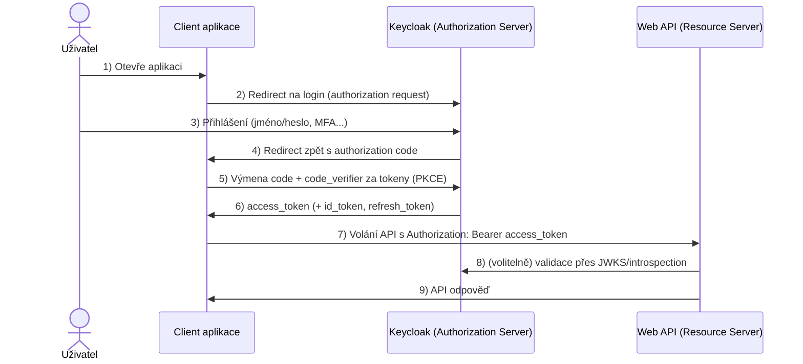

# 06 Authentication and Authorization

**autor: Erik Král ekral@utb.cz**

S asistencí: GitHub Copilot

## 🎯 Definice

U zabezpečení webových aplikací v .NET mám dvě možnosti. Buď použijeme **individual accounts** což znamená že uživatelské učty budou uloženy v databázi pomocí Entity Frameworku a Identity frameworku a projekt nám vytvoří webové stránky pro přihlášení. Nebo v případě Web Api nám vytvoří endpointy pro přihlášení a registraci.

Pokud chceme ale zabezpečit zároveň webového nebo mobilního klienta, to znamené že ve webovém klientu se přihlásíme a on bude přeposílat token do API, tak musíme použít například standard OpenId s protokolem OAuth2. V tomto případě se bude starat o správu uživatelů a přihlašování externí poskytovatel identity, například Auth0, Microsoft Entra, Identity Server, Keycloak a podobné podporující tyto standardy. Pro tento případ nám .NET poskytuje middleware pro ověřování JWT tokenů.

## Struktura projektu

Náš projekt bude mít následující strukturu:
- **UTB.School.Web** - Blazor klient
- **UTB.School.WebApi** - Web API
- **UTB.School.WebSse** - Klient zobrazující SSE zprávy.

## Keycloak

### Co je OpenID a OpenID Connect

**OpenID Connect (OIDC)** je vrstva nad OAuth 2.0, která přidává **autentizaci uživatele**.

- OAuth 2.0 řeší hlavně **autorizaci** (kdo smí přistupovat k jakému API).
- OpenID Connect řeší **identitu uživatele** (kdo je přihlášený uživatel).

Proto v praxi často říkáme:
- OAuth2 = přístup k API
- OIDC = přihlášení uživatele

OpenID Connect navíc definuje například:
- `id_token` (token s identitou uživatele),
- endpoint `userinfo`,
- standardní claimy (`sub`, `email`, `preferred_username`, ...).

### Jak funguje OAuth2 (Authorization Code Flow)

Nejčastější scénář pro webovou aplikaci + API je **Authorization Code flow**.

#### Role

- **Uživatel**: člověk v prohlížeči
- **Client**: aplikace (např. Blazor Web)
- **Authorization Server**: Keycloak
- **Resource Server**: Web API

#### Tok požadavků



Poznámka:
- Ve SPA se dnes doporučuje Authorization Code flow s PKCE.
- `access_token` je pro API, `id_token` je pro klienta (identita), `refresh_token` slouží k obnovení session bez nového loginu.

#### Co znamená `ResponseType = Code`

Nastavení `ResponseType = Code` znamená, že klient používá **Authorization Code flow**.

Keycloak v prvním kroku nevrací tokeny přímo do prohlížeče, ale vrátí jen krátkodobý **autorizační kód** (`code`).
Teprve backend aplikace tento kód vymění na token endpointu za tokeny.

Průběh krok za krokem:
- 1) Klient pošle uživatele na authorization endpoint s `response_type=code` + PKCE (`code_challenge`, `code_challenge_method=S256`).
- 2) Uživatel se přihlásí v Keycloaku.
- 3) Keycloak přesměruje prohlížeč zpět na `redirect_uri` s parametrem `code`.
- 4) Aplikace na serveru pošle `POST` na token endpoint (`grant_type=authorization_code`, `code`, `redirect_uri`, `client_id`, `code_verifier`, případně i `client_secret`).
- 5) Keycloak vrátí `access_token`, případně `id_token` a `refresh_token`.

Co je důležité:
- přes browser (query string) jde jen autorizační požadavek a návrat s kódem,
- výměna kódu za tokeny je backchannel komunikace server <-> Keycloak,
- to je bezpečnější než implicit flow, kde se tokeny vracely přímo do frontendu.

#### Typy tokenů

| Token | Formát | Pro koho | Účel |
|---|---|---|---|
| `access_token` | JWT | Resource Server (API) | Autorizace přístupu k API |
| `id_token` | JWT | Client (aplikace) | Identita přihlášeného uživatele |
| `refresh_token` | neprůhledný řetězec | Authorization Server | Obnovení access tokenu bez nového loginu |

#### Co je id_token

**id_token** je JWT token definovaný standardem OpenID Connect. Na rozdíl od `access_token` není určen pro API, ale pro **klientskou aplikaci** — říká aplikaci, kdo se přihlásil.

Keycloak vystaví `id_token` pokud scope obsahuje `openid`.

##### Jak vypadá požadavek na Keycloak

Klient při přesměrování uživatele na login posílá authorization request, například:

```http
GET /realms/utb-school/protocol/openid-connect/auth?
	client_id=utb-school-web&
	response_type=code&
	redirect_uri=https%3A%2F%2Flocalhost%3A5001%2Fsignin-oidc&
	scope=openid%20profile%20email&
	code_challenge=Rk9vQmFyQmF6MTIzNDU2Nzg5X1NIRTI1Ng&
	code_challenge_method=S256&
	state=xyz123&
	nonce=abc123 HTTP/1.1
Host: auth.example.cz
```

Následně proběhne výměna `code` za tokeny přes backchannel `POST` na token endpoint:

```http
POST /realms/utb-school/protocol/openid-connect/token HTTP/1.1
Host: auth.example.cz
Content-Type: application/x-www-form-urlencoded

grant_type=authorization_code&
code=SplxlOBeZQQYbYS6WxSbIA&
redirect_uri=https%3A%2F%2Flocalhost%3A5001%2Fsignin-oidc&
client_id=utb-school-web&
code_verifier=QWxhZGRpbjpvcGVuIHNlc2FtZQ
```

Poznámka: u confidential klienta může být navíc poslán i `client_secret`.

Nejdůležitější je parametr `scope`:
- `scope=openid ...` -> požadujeme OpenID Connect, Keycloak vrátí i `id_token`.
- bez `openid` -> běží jen OAuth2 autorizace a `id_token` se obvykle nevrací.

Po výměně autorizačního kódu na token endpointu vrací Keycloak například:

```json
{
	"access_token": "eyJ...",
	"expires_in": 300,
	"refresh_expires_in": 1800,
	"refresh_token": "eyJ...",
	"token_type": "Bearer",
	"id_token": "eyJ...",
	"scope": "openid profile email"
}
```

Pole `id_token` je v odpovědi právě proto, že v požadavku byl scope `openid`.

Příklad dekódovaného payloadu `access_token` (z téhož token response):

```json
{
	"iss": "https://auth.example.cz/realms/utb-school",
	"sub": "8f2d9a30-2e24-4f8b-9d27-67d3ff19f145",
	"aud": ["account", "utb-school-api"],
	"exp": 1776751200,
	"iat": 1776747600,
	"typ": "Bearer",
	"azp": "utb-school-web",
	"scope": "openid profile email",
	"preferred_username": "novakj",
	"email": "jan.novak@utb.cz",
	"realm_access": {
		"roles": ["student"]
	},
	"resource_access": {
		"utb-school-api": {
			"roles": ["read:marks", "write:homework"]
		}
	}
}
```

`access_token` je určený pro API (Authorization: Bearer ...), proto obsahuje hlavně autorizační claimy jako `aud`, `scope` a role. `realm_access` jsou realm role a `resource_access` jsou client role.

Příklad dekódovaného payloadu `id_token`:

```json
{
  "iss": "https://auth.example.cz/realms/utb-school",
  "sub": "8f2d9a30-2e24-4f8b-9d27-67d3ff19f145",
  "aud": "utb-school-web",
  "exp": 1776751200,
  "iat": 1776747600,
  "nonce": "abc123",
  "typ": "ID",
  "preferred_username": "novakj",
  "email": "jan.novak@utb.cz",
  "given_name": "Jan",
  "family_name": "Novák"
}
```

Zdůraznění klíčových rozdílů od `access_token`:
- `typ` má hodnotu `"ID"` (u access tokenu je `"Bearer"`).
- `aud` je **id klienta** (aplikace), ne API.
- Neobsahuje role a resource_access — ty patří do `access_token`.

### Co je Keycloak

**Keycloak** je open-source Identity and Access Management (IAM) server.

Poskytuje:
- přihlášení uživatelů (login),
- správu uživatelů, rolí a skupin,
- vystavování tokenů (JWT),
- podporu standardů OAuth2 a OpenID Connect,
- centralizované SSO pro více aplikací.

### Pojmy v Keycloaku

#### Claim

**Claim** je pojmenovaná informace (klíč–hodnota) uložená v tokenu.

Například:
- `"email": "jan.novak@utb.cz"` — emailová adresa uživatele,
- `"sub": "8f2d9a30-..."` — jedinečný identifikátor uživatele,
- `"realm_access": { "roles": ["student"] }` — role uživatele.

Claims jsou serializovány jako JSON objekt v payloadu JWT. Jejich obsah a názvy jsou dány:
1. standardy (OIDC, OAuth2) — např. `sub`, `iss`, `exp`, `email`,
2. mapováním nastaveným v Keycloaku (client scopes, mappers).

> **Claim** = konkrétní datová položka v tokenu. **Scope** = pojmenovaná skupina claimů, která se přidá do tokenu.

#### Realm

**Realm** je izolovaný prostor (tenant), ve kterém existují:
- uživatelé,
- role,
- klienti,
- konfigurace autentizace.

Co je v jednom realm, není automaticky dostupné v jiném realm.

#### Client

**Client** reprezentuje aplikaci, která komunikuje s Keycloakem.

Příklady:
- frontend aplikace (Blazor/Web SPA),
- backend API,
- mobilní aplikace.

U clienta nastavujeme například:
- typ přístupu (public/confidential),
- redirect URI,
- povolené flow,
- client scopes.

#### Client Scope

**Client scope** je balíček claimů a pravidel, který říká, jaké informace se mají dostat do tokenu.

Může být:
- **default** (přidá se automaticky),
- **optional** (přidá se jen když si ho client explicitně vyžádá).

##### Mapping v client scope

V Keycloaku znamená **mapping** to, **jaké údaje (claimy) se vloží do tokenu** a jak se budou jmenovat.

Příklady mappingu:
- uživatelské jméno -> `preferred_username`,
- email -> `email`,
- role -> `realm_access.roles` nebo `resource_access.<client>.roles`.

#### Audience Mapper

**Audience mapper** doplňuje claim `aud` (audience), tedy pro koho je token určen.

To je důležité pro API validaci:
- API může odmítnout token, který není určený právě pro něj,
- pomáhá oddělit tokeny mezi různými službami.

#### Users client scope

`users` (nebo obdobně pojmenovaný scope v dané instalaci) bývá používán pro claimy vztahující se k uživateli.

Typicky obsahuje mappingy jako:
- `name`,
- `preferred_username`,
- `given_name`,
- `family_name`,
- `email`.

Konkrétní obsah je vždy dán konfigurací v daném realm.

#### Realm users

**Realm users** jsou uživatelské účty uložené přímo v daném realm.

Jejich data (username, email, role, skupiny, atributy) se mohou přes mapping propsat do tokenů.

### Ukázka JWT tokenu a mapování

JWT má tvar:

`header.payload.signature`

- `header`: metadata (algoritmus, typ tokenu),
- `payload`: claimy (data o uživateli a oprávněních),
- `signature`: kryptografický podpis.

#### Příklad access tokenu (zakódovaný JWT)

Takto vypadá skutečný `access_token` — tři Base64URL části oddělené tečkou:

```
eyJhbGciOiJSUzI1NiIsInR5cCIgOiAiSldUIiwia2lkIiA6ICJhYjEyY2Q
zNCJ9.eyJleHAiOjE3NzY3NTEyMDAsImlhdCI6MTc3Njc0NzYwMCwiaXNzIj
oiaHR0cHM6Ly9hdXRoLmV4YW1wbGUuY3ovcmVhbG1zL3V0Yi1zY2hvb2wiLC
JhdWQiOlsiYWNjb3VudCIsInV0Yi1zY2hvb2wtYXBpIl0sInN1YiI6IjhmMm
Q5YTMwLTJlMjQtNGY4Yi05ZDI3LTY3ZDNmZjE5ZjE0NSIsInR5cCI6IkJlYX
JlciIsImF6cCI6InV0Yi1zY2hvb2wtd2ViIiwic2NvcGUiOiJvcGVuaWQgcH
JvZmlsZSBlbWFpbCByb2xlcyIsInByZWZlcnJlZF91c2VybmFtZSI6Im5vdm
FraiIsImVtYWlsIjoiamFuLm5vdmFrQHV0Yi5jeiIsInJlYWxtX2FjY2Vzcy
I6eyJyb2xlcyI6WyJzdHVkZW50Il19fQ.podpis_RS256
```

Každou část lze dekódovat (např. na [jwt.io](https://jwt.io)):

- část 1 (header): `{"alg":"RS256","typ":"JWT","kid":"ab12cd34"}`
- část 2 (payload): viz JSON níže
- část 3 (signature): kryptografický podpis pomocí privátního klíče Keycloaku — nelze dekódovat, pouze ověřit

#### Příklad dekódovaného payloadu access tokenu

```json
{
	"exp": 1776751200,
	"iat": 1776747600,
	"iss": "https://auth.example.cz/realms/utb-school",
	"aud": ["account", "utb-school-api"],
	"sub": "8f2d9a30-2e24-4f8b-9d27-67d3ff19f145",
	"typ": "Bearer",
	"azp": "utb-school-web",
	"scope": "openid profile email roles",
	"preferred_username": "novakj",
	"email": "jan.novak@utb.cz",
	"realm_access": {
		"roles": ["student", "offline_access"]
	},
	"resource_access": {
		"utb-school-api": {
			"roles": ["read:marks", "write:homework"]
		}
	}
}
```

#### Jak se claimy mapují z Keycloaku

- `iss`: generuje Keycloak podle URL a názvu realm.
- `sub`: interní ID uživatele v realm.
- `aud`: doplní například Audience mapper.
- `preferred_username`, `email`: mapování z profilu uživatele (často přes scope jako profile/email/users).
- `realm_access.roles`: role přiřazené uživateli na úrovni realm.
- `resource_access.<client>.roles`: role přiřazené uživateli pro konkrétní client.

Praktický důsledek:
- Když v Keycloaku změníme mapping v client scope, změní se obsah claimů v nově vydaných tokenech.
- API autorizace pak musí očekávat stejné názvy claimů, jaké mapujeme.

### Shrnutí pro praxi v .NET

- V klientu řešíme login přes OpenID Connect.
- V API ověřujeme JWT `access_token`.
- V Keycloaku pečlivě nastavíme realm, client, scopes a mappingy claimů.
- V autorizaci v API kontrolujeme role/scope/audience podle obsahu tokenu.
