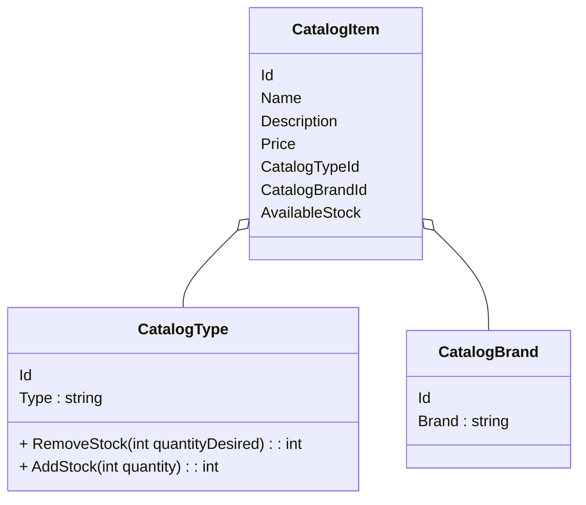
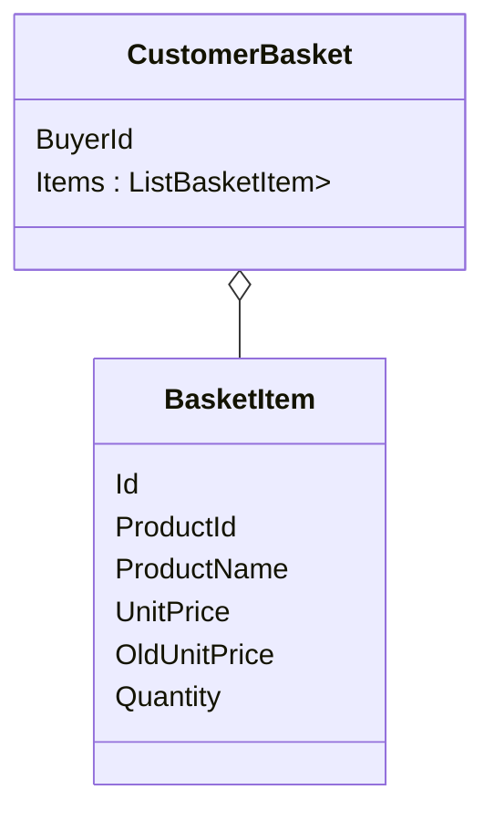

# Class Diagram for Microsoft eShop

Simplified UML Class diagram for Microsoft eShop Reference Application - "Northern Mountains":
https://github.com/dotnet/eShop

## Catalog API



## Basket API



# Ordering API

```mermaid
class Buyer{
   Id
   Name
   PaymentsMethods : IEnumerable<PaymentMethod>
   + VerifyOrAddPaymentMehtod(CreditCardInfo creditcard) : PaymentMethod
}

class PaymentMethod{

   
}


```